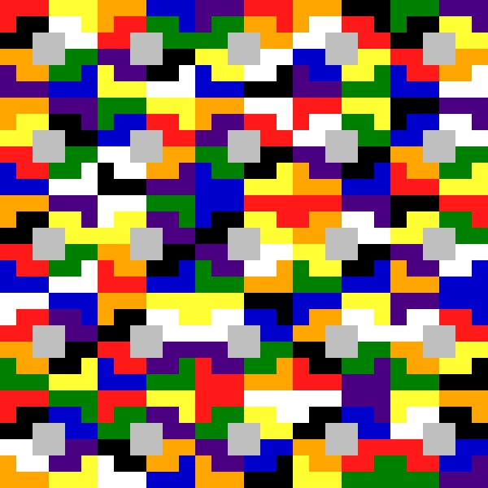

## Alignment of complementary colors on a grid

The exercise was taken from book 
[10 exercises for building color structures by Andrey Tukanov](https://tatlin.ru/shop/10_uprazhnenij_postroeniya_czvetovyx_struktur)

###### Translation from Russian:

The exercise was proposed by the artist Wassily Kandinsky to Bauhaus students
in the “Course and Seminar on Color Science” in 1923. 
In our interpretation, it is performed in a square or rectangle,
where 4 pairs of symmetrically arranged complementary colors are randomly placed. 

Three pairs of spectral colors are red and green, blue and orange,
violet and yellow, and the fourth pair is black and white. 
The central symmetry of complementary colors located around the neutral middle
provides compositional balance to any arrangement of color pairs. 
When considering the composition from a sufficient distance,
the feeling of the materiality of the color pigment disappears 
and the effect of the “vibration” of the color and the “glow”
of the entire picture plane appears. 

This feeling of glow is fundamental in determining the quality
of the color composition in all subsequent exercises.
When visiting a museum, using the example of classical 
painting, you need to learn to distinguish the degree of such a glow.

###### Analysis

There are 8 colors to be placed on the grid. Colors could be places randomly. 
There are <em>8! = 40320</em> ways
to place 8 colors randomly on this grid.  

###### Idea

Let's generate random alignments of colors on the gird. Let's place it all on one squared picture. 
It should look like a pattern! It is supposedly should "provides compositional balance"

